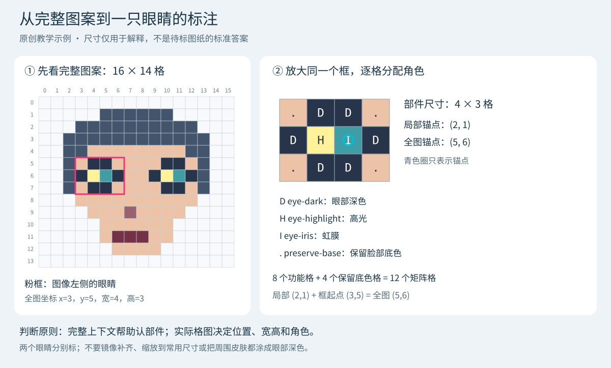
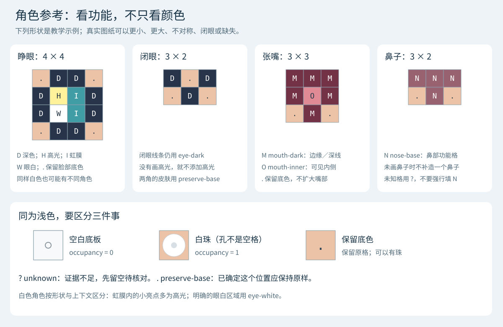

# 历史部件角色标注指南

> 2026-10-01：当前 SDXL 配对标注请使用[区域配对标注指南](region-annotation-guide.md)。蒙版只基于拼豆格图，无需原照片／插画。本页仍为旧 v1 部件角色审核的历史说明。

> **2026-09-30 适用范围更正**：本文保留为现有 v1 部件角色审核页的操作说明。新目标已改为[全图条件下的区域生成＋adapter](plans/bead-facial-template-learning-plan.md)，不再训练模板宽高和角色矩阵模型。新训练标签以可改区、完整输入和人工接受的修改后格图为主；眼白／虹膜等逐格角色是可选诊断，无需为新路线把每张都补齐。新增生成前后实验页的操作、参考图与 prompt 见 [SDXL 使用说明](../services/sdxl-region-sidecar/README.md#操作)，与下述旧页面分开；正式资格审定和训练集导入仍待完成。

适用页面：**五官模板 · 预标注审核**（[本机入口](http://127.0.0.1:7116/pilot/review/)）。本文介绍当前已经实现的操作，不要求标注者编写 JSON。

**一张图的工作可以拆成两步：先确认每格有没有珠子，再告诉系统哪些格子构成眼、鼻、嘴，以及它们分别起什么作用。** 不需要把所有部件都改成同一种形状，也不用把整张脸重新画一遍。

当前采用浏览器暂存和 JSON 导出／命令导入，尚无在线保存 API。审核者可以先完成明确的部件，把疑难项留作草稿。标注说明与原图冲突时，以原图可见证据为准；不确定就保留未知。

## 1. 有哪些参考图可以看

每张样本已有三个相互补充的视图：

| 参考 | 主要看什么 | 注意事项 |
| --- | --- | --- |
| 原页 | 完整设计、作者信息、格数和珠子外观 | 图例、标题与签名不属于图案 |
| 完整图案面板 | 脸型、头发、另一只眼、表情、遮挡关系 | 用它判断某个色块是眼睛、眉毛、头发还是装饰 |
| 还原格图 | 部件占了哪些格、宽高、颜色分布 | 这是读格结果，格点或颜色有误时仍须回看原页 |

审核页中这三个选项位于 **“分图输入”**。叠加的粉色、蓝色、橙色分别是模型的眼、鼻、嘴候选；模型没有检测到的部件仍可能画在图上。切换这个视图只改变左侧展示，右侧当前选中的候选要在部件下拉框里另选，不能把不同视图误当成三个独立样本。

**当前数据集没有逐张配对的原始动漫插画或照片。** 如果手头有同一设计对应的原插画，可以放在旁边帮助理解表情和遮挡，但尺寸与逐格标签必须来自当前拼豆图纸。原插画有鼻子、图纸没画鼻子时，不给图纸补一个鼻子；其他同角色图片也不是这张图的真值。

下面两张图是仓库内的原创教学示例，可以直接对照使用；它们不属于真实标注数据，不规定其他样本必须长成这样。

### 参考图 A：从全图找到部件，再定义矩阵



示例左眼的框为 `x=3, y=5, 宽=4, 高=3`。这里说的“左眼”指画面左侧，不是角色自身的解剖左右。

### 参考图 B：不同角色，以及容易混淆的浅色格



参考图的意义是帮助理解“这个格子做什么”。实际模板可以是 `1×1`，也可以是不同宽高的矩形；不要为了套参考图而放大、缩小或镜像补全。

## 2. 第一次使用：先完整标一张

### 第一步：选择清楚的样本和审核者

在顶部填写固定的审核者姓名或标识。先选一张格子清楚、五官容易辨认的图，完整查看原页和图案面板。

本轮预标注只在 6/24 张图纸上得到眼部候选，鼻、嘴没有候选，因此下拉框为空并不表示没有可标部件。可以使用 **“补一个漏检部件”** 手动建立标注。

### 第二步：核对完整格图

查看 **“完整格图与占用复核”**，依次检查：

1. 行列数和格线有没有对齐，是否包含完整图案。
2. 珠子颜色有没有明显采错，是否把孔洞或网格线读成了珠子颜色。
3. 每格是有珠、空白，还是看不清。

“占用”表示有没有珠子，与格子是什么颜色无关：

| 格子情况 | 应标占用 | 例子 |
| --- | --- | --- |
| 有珠 | `1` | 白珠、黑珠、皮肤色珠均一样 |
| 空白底板 | `0` | 只有底板小钉孔，没有珠子 |
| 看不清 | `null`／未知 | 压缩、遮挡或取样错误使珠子状态不明确 |

从 **“格图操作”** 选择 **“点一个空白格，按精确颜色区分占用”**，再点一个确认的空白底板格。页面会生成一份占用草稿：同一 RGB 标为空白，其余标为有珠。**这只是批量初填**，之后必须检查白珠、边缘和其他同色区域；可切换“标为有珠”“标为空白”“标为占用未知”逐格修正。

如果整张图没有空白格，不要找一个白珠充当空白参考。逐格标为有珠即可；大面积手工修改前先导出草稿。

只有确认了完整格图且没有未知占用格，才勾选 **“已核对完整方格范围、格点位置、颜色和所有占用格”**。当前页面不能修正面板范围、全图格数或 RGB 取样；遇到这些问题先保持未确认，由处理工具修正校准并建立新运行，不能靠改部件框掩盖。

### 第三步：选中或补充一个部件

在 **“部件与角色修正”** 下拉框选择眼、鼻或嘴的候选；检查来源视图和模型证据。

如果原图有部件但没有候选，选择旁边的“眼／鼻／嘴”，点击 **“补一个漏检部件”**。此时会新增一个 `1×1` 的未知草稿，需要自己设定正确框。两只眼要分别建两个部件；不要把整张脸、两只眼加鼻子一起框成一只眼。

### 第四步：填写格框

`x/y` 是部件框左上角在**完整格图**中的位置，均从 `0` 开始。宽、高是格数，不是 PNG 像素。

例如：

```text
完整图案：16 × 14 格
左眼框：x=3，y=5，宽=4，高=3
占据全图列：3、4、5、6
占据全图行：5、6、7
```

填写后点击 **“重设框与角色”**，再看完整格图中的粉框是否对齐。**该按钮会把框内角色全部重置为未知**，所以先定好框，再细修角色。

框应紧贴这个部件的功能格，保留内部必要的底色位置；不要额外加一圈皮肤或把邻近眉毛、头发纳入功能格。单格眼睛就标 `1×1`。倾斜或不对称的眼睛保持原形，不强行变正或统一大小。

### 第五步：逐格分配颜色角色

“角色”描述格子在部件里的作用，**不是 Perler/MARD 色号，也不是按 RGB 自动命名**。

| 页面角色 | 保存值 | 判断依据 |
| --- | --- | --- |
| 眼部深色 | `eye-dark` | 明确属于眼睛的深色轮廓、瞳孔、闭眼线条等 |
| 眼部高光 | `eye-highlight` | 眼内明确表达反光的小亮点，不是所有浅色格 |
| 虹膜 | `eye-iris` | 表达虹膜颜色的部分；黑色与虹膜边界看不清时不要硬分 |
| 眼白 | `eye-white` | 明确属于眼白的区域，不是白色皮肤、背景或底板 |
| 鼻部主色 | `nose-base` | 明确构成鼻子的格子；首版没有更多鼻部角色 |
| 嘴部深色 | `mouth-dark` | 嘴唇／嘴部深色边界或闭嘴线条 |
| 嘴内部 | `mouth-inner` | 张开的嘴中明确的内侧区域；没画就不添加 |
| 保留底色 | `preserve-base` | 这个位置确定不应被该模板改写，比如框角的皮肤或内部间隙 |
| 未知 | `unknown` | 不确定这个位置的角色，后续需要核对；它不是背景或 padding |

操作时将 **“格图操作”** 设为 **“涂颜色角色（当前部件）”**，选择“画笔角色”，在完整格图的当前框内点选或拖动。

如果大多数未知格确实属于同一角色，可以先点 **“把框内未知格设为当前角色”**，再单独修高光、虹膜和保留底色。手工重设过的框全部是未知，此按钮会填充整个框，不能认为它只会填模型蒙版；填完务必把框角皮肤等还原为“保留底色”。

参考图 A 的角色矩阵是：

```text
. D D .
D H I D
. D D .

D = eye-dark
H = eye-highlight
I = eye-iris
. = preserve-base
```

它有 12 个矩阵格，其中 8 个是功能格、4 个保留底色。4 个保留底色格可能仍有皮肤色珠子，因此 **`preserve-base` 不等于 `occupancy=0`**。

### 第六步：确认锚点、可见性和侧别

锚点用于把局部模板放回全图，是一个**模板内的格坐标**。当前页面默认取 `(floor(宽/2), floor(高/2))`；没有明确修正依据时先保留默认值，同一批次按一致规则复核。

在上述 `4×3` 示例里，默认局部锚点是 `(2,1)`；全图位置为 `(3+2,5+1)=(5,6)`。若需要改动，将“格图操作”改为 **“设置当前部件锚点”**，点击框内对应格。青色点只是锚点标记，不表示高光或眼白。

再选择可见性和图像侧别：

| 观察到的情况 | 标注状态 | 可见性及处理 |
| --- | --- | --- |
| 眼／鼻／嘴清楚可见 | 可表达的部件 | 可见 |
| 画的是闭眼 | 可表达的部件 | 可见；闭眼不是不存在 |
| 部分被头发遮挡，仍有可确定的功能格 | 可表达的部件 | 遮挡；只标图纸可确认的结构，不补遮挡后的形状 |
| 确认整个部件被遮挡，不应生成模板 | 无需模板 | 遮挡 |
| 确认设计本来就没画该部件 | 无需模板 | 原本未画 |
| 原图明明有，模型没找到 | 先补部件 | 人工找到后按可见／遮挡处理；不能标成原本未画 |
| 无法确定部件是否存在或框在哪里 | 暂不确定 | 未知，保持未确认 |

眼的左右按图像坐标：画面左边选“图像左侧”。独立眼图无法确定侧别时保持未知；鼻、嘴一般选“不适用”。

错误检测与部件不存在也要分开：如果模型把头发当成眼睛，而真正的眼睛在别处，错误候选保持未确认／暂不确定，再补正确部件。当前页面没有独立的“拒绝误检”分类，不要为凑一个确认状态把它改成“原本未画”。

切换成“无需模板”或“暂不确定”会清空该草稿的框与矩阵；修改前可先导出，或使用当前部件撤销。

### 第七步：确认并导出

当框、角色、锚点和可见性都已经核对后，勾选 **“已核对这个部件的宽高、角色、锚点及可见性”**。边界确定但少数格角色仍不明确时可保留 `unknown`；整体形状或边界都不确定时不要确认。页面能通过校验不等于语义判断正确。

点击顶部 **“导出审核记录／草稿”**，保存 `template-reviews.json`。建议每完成一张就导出一次，使用不同文件名保留进度。

- 浏览器会自动暂存并支持刷新恢复，但不等于已经提交给后端。
- 更换浏览器、网址、端口或打开 `file://` 版本时，暂存可能不共享；用导出的文件恢复。
- **“载入导出的记录”** 只接受同一审核包，并会用载入的记录替换当前页面草稿；载入前先导出当前进度。
- **“撤销当前部件操作”** 只覆盖当前部件，不是占用、分组和资格的全局撤销；切换样本／部件会清空当前撤销栈。

## 3. 分组和训练资格怎么填写

这两项可以暂缓，不妨碍先标明确的部件；不确定时保持未确认即可。

**设计分组**：看页面下方的关联参考图，判断它们是否属于同一设计／身份。裁剪、镜像、换色、同图左右眼，以及已知同一角色／身份的关联版本应放在同一来源组，避免分到训练和测试两边。填写稳定组名，例如 `character-miku` 或无已知身份时的 `design-001`；相关记录应使用一致组名，不用“看起来颜色相近”作为唯一依据。

相似检索可能漏掉同角色的不同姿态，也可能把不同作品误连。逐项选择“同一设计／身份组”“不同设计／身份组”或“尚未判断”；全部关系已判断且组名明确后，才勾选分组确认。建议连通组数不等于独立设计数，当前页面也不会自动冻结训练／测试切分。

**训练使用资格**：只填写已经掌握的实际来源依据。已下载、已标好或网上公开可见都不自动改写当前“待确认”状态。没有明确依据时继续选“待确认”；确认允许训练时填写自有作品／作者许可／适用许可，以及可追溯的记录或链接。不要把标注问题写进许可依据栏。

## 4. 可以直接复制的辅助 prompt

下面的提示词用于请视觉模型或协作者**给出可核对的建议**，不能替代最终人工确认。发给模型时，最好同时提供完整图案、带坐标的清晰格图和局部放大图；仅给一张缩小网页截图时，模型可能会数错格子。

### Prompt A：帮我理解并起草部件标注

```text
你是拼豆图纸标注助手。请分析实际图纸，给出待核对的标注建议。

我会提供：
1. 完整图案或原始图纸；
2. 带坐标的完整格图，宽 W={填写}、高 H={填写}，x 向右、y 向下，均从 0 开始；
3. 如有：同一部件的局部放大图，及它在全图中的范围；
4. 如有：原始插画，仅用于语义参考。

任务：识别图纸真正画出的眼、鼻、嘴。先用全图判断部件，再给逐格建议。
两眼分开，左右按图像坐标；闭眼属于可见眼睛。
不要把眉毛、头发、装饰、图例文字或珠孔当成眼鼻嘴。
不要镜像补齐、补画缺失部件、缩放模板或把尺寸限制为 3×3 等固定规格。

角色限定为：
眼：eye-dark、eye-highlight、eye-iris、eye-white；
鼻：nose-base；嘴：mouth-dark、mouth-inner；
保持原格：preserve-base；不能确定：unknown。
白珠不等于空白；白色不自动等于眼白；高光也不等于珠孔。

请逐部件输出：
- 是哪个部件、图像侧别、可见性，以及判断依据；
- 全图格框 x/y/width/height；
- 与宽高严格一致的逐行角色矩阵；
- 模板局部锚点建议和对应的全图坐标；
- 不确定的格子及原因；
- 哪些判断直接来自图纸，哪些仅由参考插画提示、不能落为标签。

不能可靠数格时，格框和矩阵写 null，并说明需要什么更清晰的材料。
未检测到不等于原本未画。确认不了是否存在时写 unknown。
禁止把建议称作人工已审核真值；不要填写 reviewer、confirmed 或训练授权。
```

模型输出是说明草稿，**不是当前页面可直接导入的审核包**。应回到审核页逐项核对后填写；不要让模型伪造审核包哈希或人工确认记录。

### Prompt B：检查我已经标好的结果

```text
请对照完整拼豆图纸、带坐标格图和我的标注，做一致性复核，不重新设计图案。

完整格图：W={填写}，H={填写}。
部件类型／侧别／可见性：{填写}。
全图格框：x={填写}，y={填写}，width={填写}，height={填写}。
角色矩阵（逐行）：{粘贴}。
局部锚点：{填写}。

逐项检查：
1. 框是否在完整画布内，矩阵是否恰好有 height 行、每行 width 格；
2. 是否只包含当前部件，混入了眉毛、头发或多余皮肤；
3. 眼白／高光／虹膜是否有视觉依据，有无仅按颜色猜角色；
4. preserve-base 与 unknown、空白占用是否混淆；
5. 是否擅自补了遮挡、未画或另一只眼睛；
6. 锚点是否在矩阵内，全图锚点是否等于框起点＋局部锚点；
7. 当前图纸是否支持这些精确尺寸，还是需要更清楚的格图。

按“明确错误 / 待核对 / 已有证据支持”列出具体位置和依据。
不确定的地方不要强判正确；通过格式检查不等于语义正确。
不要替我确认人工审核或训练资格。
```

### Prompt C：有原始插画时，辅助理解抽象的拼豆色块

```text
图 A 是当前拼豆图纸，图 B 是同一设计对应的参考插画。
请帮助我理解图 A 中抽象色块的语义，不从图 B 补画内容。

按部件列出：
- 图 A 直接可见的证据；
- 图 B 提供的表情／朝向／遮挡线索；
- 图 B 有、图 A 未明确表达的细节；
- 仍然无法确定的地方。

部件格数、位置和角色标签必须由图 A 决定。
如果两图并非同一设计或对应关系不清楚，先指出不匹配，停止逐格推断。
特别区分闭眼与缺失、眼白与高光、眉毛与眼睛、珠孔与图案亮点。
输出易核对的解释，不生成新图，不把推测当作已审核标签。
```

## 5. 完成一张后的检查表

- [ ] 格数、完整范围和格点对齐；白珠与空白没有混淆。
- [ ] 两眼分别标注，鼻、嘴仅在图纸有依据时标注。
- [ ] 每个部件框和矩阵尺寸一致，保留内部必要底色，没有人为外圈。
- [ ] 高光、眼白等角色有依据；不确定项保留未知或草稿。
- [ ] 锚点、图像侧别和可见性已核对，未把漏检当成不存在。
- [ ] 同一部件三视图没有被当成三个独立样本反复确认。
- [ ] 分组和来源资格已填写真实状态；尚不明确的保持未确认。
- [ ] 已导出 JSON，而不只依赖浏览器暂存。

## 6. 导出后如何入库

目前由离线 Python 工具导入，不通过网页直接写数据库。在仓库根目录执行下面命令，替换实际导出文件位置，并给每次导入一个新的输出目录：

```powershell
$ftPython = 'services/sam2-sidecar/.venv/Scripts/python.exe'
& $ftPython tools/template-learning/review.py import `
  --run output/template-learning/ft1-preannotation-v1 `
  --reviews 'C:/path/to/template-reviews.json' `
  --output output/template-learning/review-import-01
```

导入工具检查原图／格图版本、矩阵和人工确认信息，分别保存审核目标与原始预测。未确认草稿不会算作人工真值。实际训练还需要独立设计切分和质量验证，标完一张不自动启动训练。

模型、批量处理、生成新审核包及复现命令见[模板学习工具说明](../tools/template-learning/README.md)。规则模板库已删除；历史部件标注及其[离线契约](../tools/template-learning/task-contract.md)保留用于人工记录和数据追溯；遇到界面与指南不符时保留导出记录，再核对版本。
