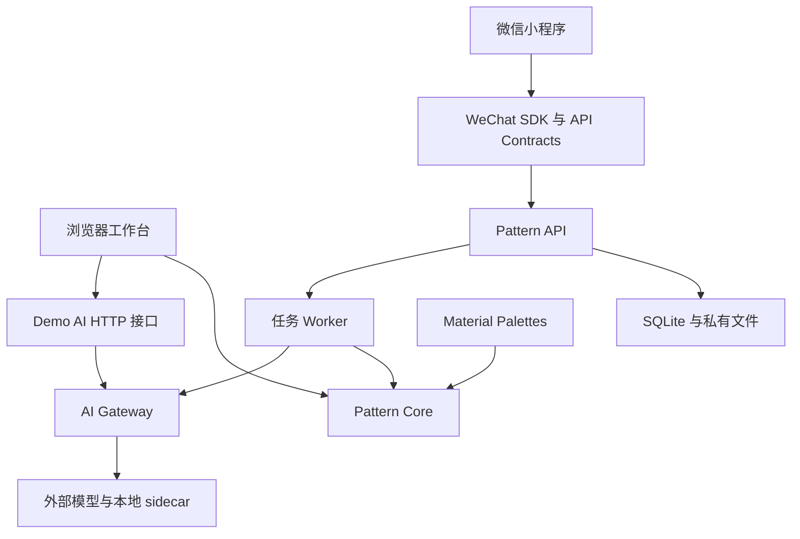

# 当前实现架构

算法版本为 `0.10.2-perler-color-fidelity`，以 [pipeline.ts](../packages/pattern-core/src/pipeline.ts) 为准。本文维护当前运行行为；后续交付与验收状态统一见[产品计划](plans/contours-features-editing-perler-123-plan.md)。

## 两条运行入口

- **浏览器工作台**：`apps/demo/index.html` 在浏览器执行核心算法；`apps/demo/server/serve.mjs` 提供静态资源和 `/api/ai/*`，由 `apps/demo/server/ai-api.mjs` 接入 Gateway。它不经过产品任务 API。
- **小程序产品链路**：`apps/wechat-miniapp` → `packages/wechat-client` → `services/pattern-api` → `src/worker.ts`。服务负责会话、上传校正、资源归属、幂等任务、取消/恢复、持久化和导出，Worker 执行分析与生成。默认一个计算 Worker，具体契约见 [API 说明](../services/pattern-api/README.md)。
- **离线评测**：`tools/auto-eval` 生成候选、取得视觉评分并应用偏好判断；`mask-gate`、`vision-gate`、`feature-gate` 分别维护蒙版、视觉证据和特征规划的评测协议与报告。评测入口不等同于产品入口。

## 依赖与构建边界

- `apps/demo` 是独立 pnpm 工作区，`src` 保存浏览器模块，`server` 保存 Node 服务，`tests` 区分单元测试、浏览器测试和服务替身。服务按文件位置定位仓库根目录，从工作区启动时仍使用相同资源 URL。
- 运行包在自己的 `package.json` 声明直接依赖；工作区依赖使用 `workspace:*`。Demo 服务通过声明的 Gateway 包导入，浏览器模块仍使用静态构建路径，不额外引入打包器。
- 根目录管理编译／测试工具和维护脚本所需的 `sharp`；Demo 的 `sharp` 用于浏览器测试并登记为开发依赖。脚本直接导入自己的依赖，不从其他服务的 `node_modules` 借用。已有 `sharp` 统一锁定在 0.35.3，本次只调整引用归属。
- 各 Python sidecar 保留独立 `pyproject.toml`、`uv.lock` 与虚拟环境。SAM2、姿态、生成提案和视觉评分的 Torch／CUDA 组合不因目录整理而合并或升级。
- 根 `pnpm build` 保持现有构建顺序。`pnpm install --frozen-lockfile` 校验 Node 锁文件；更改依赖时只更新相应引用并检查锁文件差异，不顺带升级全部包。

开发启动脚本集中在 `scripts/dev`；维护生成器在 `scripts/maintenance`；性能和质量诊断分别在 `scripts/benchmarks`、`scripts/diagnostics`。测试截图与 trace 进入 `output/tests/playwright`，性能 JSON 进入 `output/benchmarks`，临时诊断进入 `output/diagnostics`。数据集与评测记录保持各自原路径，避免破坏来源及会话关联。

## 图纸核心

公共入口为 `createPatternAlgorithm().generate()`，实现由 `algorithm.ts` 委托给 `pipeline.ts`。核心只处理内存中的 RGBA、色卡、选项和 `ImageAnalysis`；解码、方向修正和网络推理在调用侧完成。

当前 `mvp` 结构路线按以下职责组织；A0/A1 保留为最近邻和面积采样对照：

1. 校验请求、规范化分析证据及人工五官修正，建立生成身份。
2. 生成源图引导、主体形状候选、占位方案和 `CanvasPlan`。
3. 采样并确定五官离散格位，建立 `StructurePlan` 和源图映射。
4. 分别规划蒙版轮廓和 `ValuePlan`；结构路线的明暗规划关闭旧内置描边，避免与独立轮廓叠加。
5. 建立 `PalettePlan`，映射真实材料颜色，解析五官颜色并应用轮廓。MARD 291 的填色/统一描边规则在此生效。色卡注册表支持 291/123/24；Perler 保留完整 123 SKU，生成候选只使用 118 个可自动匹配颜色，详见[数据来源与边界](perler-123.md)。
6. 保护五官与轮廓，执行配色优化及 Fast/Quality 网格精修。
7. 计算原图保真、结构、拓扑与制作指标，执行质量门禁并排序，返回推荐、备选或 best-effort。

明暗处理只有一个 Lab 阶段；结构路线不再串行叠加旧的 RGB 明暗分档。

`PatternAlgorithm.adapt()` 负责锁定已制作格并调整剩余区域。它与 P6 规划中的通用逐格编辑、作品保存不是同一个接口。

## 配色与五官的当前行为

- `structure.valueMode` 支持 `preserve / adaptive / stylized`；还原风格默认保色，`valueStrength: 0` 旁路明暗调整。配色量化、几何映射和精修造成的误差通过阶段诊断分别报告，保色不表示最终零色差。
- MARD 291 自动填色排除 H7，内外轮廓使用同一个合规深色号。Perler 黑色正常参与匹配；5 个特殊材质色不自动使用。色卡参考 RGB 不等于实物测色。
- MVP 精修对清理产生的逐格额外 ΔE00 设上限：MARD 为 6，Perler 为 4；超过上限恢复清理前的匹配色。Perler 在保色／零强度时不移动结构取色位置。这些约束不保证最终总色差低于该数值。
- 35 个规则模板为项目自绘，记录宽高、功能格、保留底色格及锚点。双眼独立选型，联合搜索保留源图相对姿态，不奖励等高或等面积；缺失和手动隐藏的部件不生成。
- 五官先联合落格，再解析材料色并进入受保护的精修；嘴角作为同一嘴部组件的证据。`symmetryQuality`／`featureSymmetryError` 是兼容字段名，现表示原图相对姿态保持。
- 外／内轮廓独立开关，缺少主体证据时不制造画框；A0/A1 采样对照不套用结构模板和描边。具体请求、坐标和限额见 [API 五官参数](../services/pattern-api/README.md#轮廓与五官参数)。

Demo 的蒙版编辑区分草稿与确认，补画／擦除支持撤销重做；网络圈选失败时保留当前蒙版。确认后再触发完整生成。偏好工具位于内部入口 `?internal=1`，记录保存在浏览器本地，支持 Bradley–Terry 聚合。

## 分析证据与模型边界

Gateway 统一 Provider 注册、请求校验、超时/取消、证据融合和贡献记录。`subjectMaskEvidence` 保存模型置信度、来源、revision、人工确认和 provenance；关键点、语义区、裁剪各有独立证据。人工确认增加 trust，不覆盖原始模型 confidence。

| 能力 | 当前接入方式与范围 |
|---|---|
| 主体与部件自动蒙版 | GroundingDINO Tiny + SAM 2.1 Small：`sam2-sidecar`，Demo 与产品 Worker 均可接入 |
| 提示分割 | 同一 sidecar 的 SAM2 路线接收粗圈、框和正负点 |
| 主体抠图 | rembg/BiRefNet 适配器；仅有主体证据时不自动补画几何五官 |
| 宠物骨架 | 可选 MMPose sidecar，经配置后供 Demo/评测使用 |
| 学习像素化、生成式提案 | 可选 pixel-proposal sidecar，接入 Demo 的候选路线 |
| 视觉相似度与偏好特征 | 可选 OpenCLIP、DINOv2 sidecar，供 Demo/离线候选评分 |
| 人像专用映射 | MediaPipe 关键点、语义映射和可注入 Provider 已有实现；默认 Demo/Worker 未接入真实 MediaPipe 推理 |

标准生成不依赖所有 sidecar 同时启动；`MODEL_CATALOG` 中登记了模型也不代表本机已提供推理服务。模型版本、启动和验证范围见 [SAM2 服务说明](../services/sam2-sidecar/README.md)。

`pet-analysis.ts` 的旧几何推断仍被离线评测使用，`enrichPetGeometryAnalysis` 也仍作为公开函数保留，但正式 Gateway 不再自动调用它。后续须先迁移评测证据和公开调用方，再删除这条兼容路径。

同样，`searchFeaturePairs` 的实验导出、独立明暗规划器的轮廓接口及偏好记录兼容层仍有使用与测试，不能只因主流程使用新接口就删除。`pipeline.ts` 与 Demo 页面职责较集中，后续拆分应保持输出、生成身份与缓存行为不变。

## 评测与复现入口

常规检查使用根目录的 `pnpm test`、`pnpm typecheck`、`pnpm test:e2e`。真实质量标准分别由[蒙版](mask-failure-gate.md)、[人像视觉](vision-gate.md)、[五官](feature-planning-gate.md)协议维护。

构建后可运行 `node scripts/diagnostics/triage-color-fidelity.mjs` 做分阶段色差对照，或运行 `node scripts/diagnostics/compare-color-harmony.mjs --palette perler-123 --reference mard-291 --baseline <旧版 dist/index.js> --label perler-before-after` 比较版本。输入、配置、算法与色卡版本须一起固定；旧版本从 Git 取回，不保留多套说明文档。

`pnpm benchmark:palette` 和 `node scripts/benchmarks/benchmark-palette-memory.mjs` 用于性能回归。[24/291 耗时数据](../tests/fixtures/benchmarks/palette-2026-09-26.json)与[内存数据](../tests/fixtures/benchmarks/palette-memory-2026-09-26.json)保留为历史机器可读样本，不代表当前版本或三套色卡完整质量验收。
