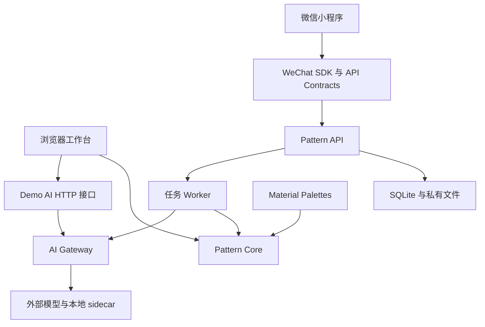

# 当前实现架构

更新日期：2026-09-28。算法版本为 `0.10.2-perler-color-fidelity`；实施状态见[项目总计划](roadmap.md)，代码收敛建议见[实现梳理与剪枝检查](implementation-pruning-2026-09-28.md)。Perler 123 配色修正见[保真记录](perler-color-fidelity-2026-09-28.md)，MARD 后处理修正见[协调性记录](mard-color-coherence-2026-09-28.md)。

## 两条运行入口

- **浏览器工作台**：`apps/demo/index.html` 在浏览器执行核心算法；`scripts/serve-demo.mjs` 提供静态资源和 `/api/ai/*`，由 `scripts/demo-ai-api.mjs` 接入 Gateway。它不经过产品任务 API。
- **小程序产品链路**：`apps/wechat-miniapp` → `packages/wechat-client` → `services/pattern-api` → `src/worker.ts`。服务负责会话、上传校正、资源归属、幂等任务、取消/恢复、持久化和导出，Worker 执行分析与生成。默认一个计算 Worker，具体契约见 [API 说明](../services/pattern-api/README.md)。
- **离线评测**：`tools/auto-eval` 生成候选、取得视觉评分并应用偏好判断；`mask-gate`、`vision-gate`、`feature-gate` 分别维护蒙版、视觉证据和特征规划的评测协议与报告。评测入口不等同于产品入口。

## 图纸核心

公共入口为 `createPatternAlgorithm().generate()`，实现由 `algorithm.ts` 委托给 `pipeline.ts`。核心只处理内存中的 RGBA、色卡、选项和 `ImageAnalysis`；解码、方向修正和网络推理在调用侧完成。

当前 `mvp` 结构路线按以下职责组织；A0/A1 保留为最近邻和面积采样对照：

1. 校验请求、规范化分析证据及人工五官修正，建立生成身份。
2. 生成源图引导、主体形状候选、占位方案和 `CanvasPlan`。
3. 采样并确定五官离散格位，建立 `StructurePlan` 和源图映射。
4. 分别规划蒙版轮廓和 `ValuePlan`；结构路线的明暗规划关闭旧内置描边，避免与独立轮廓叠加。
5. 建立 `PalettePlan`，映射真实材料颜色，解析五官颜色并应用轮廓。MARD 291 的填色/统一描边规则在此生效。色卡注册表支持 291/123/24；Perler 保留完整 123 SKU，生成候选只使用 118 个可自动匹配颜色，详见[数据来源与边界](perler-123.md)。
6. 保护五官与轮廓，执行配色优化及 Fast/Quality 网格精修。
7. 计算原图保真、结构、拓扑与制作指标，执行质量门禁并排序，返回推荐、备选或 best-effort。

明暗处理已收敛到 Lab 流程；旧的 RGB `designRegionValues` 没有调用方，已在本次整理中移除。历史文档中的多次明暗串行处理描述只适用于修正前版本。

`PatternAlgorithm.adapt()` 负责锁定已制作格并调整剩余区域。它与 P6 规划中的通用逐格编辑、作品保存不是同一个接口。

## 分析证据与模型边界

Gateway 统一 Provider 注册、请求校验、超时/取消、证据融合和贡献记录。`subjectMaskEvidence` 保存模型置信度、来源、revision、人工确认和 provenance；关键点、语义区、裁剪各有独立证据。人工确认增加 trust，不覆盖原始模型 confidence。

| 能力 | 当前接入方式与范围 |
|---|---|
| 主体与部件自动蒙版 | Grounded-SAM-2：`sam2-sidecar`，Demo 与产品 Worker 均可接入 |
| 提示分割 | 同一 sidecar 的 SAM2 路线接收粗圈、框和正负点 |
| 主体抠图 | rembg/BiRefNet 适配器；仅有主体证据时不自动补画几何五官 |
| 宠物骨架 | 可选 MMPose sidecar，经配置后供 Demo/评测使用 |
| 学习像素化、生成式提案 | 可选 pixel-proposal sidecar，接入 Demo 的候选路线 |
| 视觉相似度与偏好特征 | 可选 OpenCLIP、DINOv2 sidecar，供 Demo/离线候选评分 |
| 人像专用映射 | MediaPipe 关键点、语义映射和可注入 Provider 已有实现；默认 Demo/Worker 未接入真实 MediaPipe 推理 |

标准生成不依赖所有 sidecar 同时启动；`MODEL_CATALOG` 中登记了模型也不代表本机已提供推理服务。自动蒙版当前规则及真实模型验证边界见[神经蒙版记录](neural-masks-2026-09-27.md)。

`pet-analysis.ts` 的旧几何推断仍被离线评测使用，`enrichPetGeometryAnalysis` 也仍作为公开函数保留，但正式 Gateway 不再自动调用它。后续须先迁移评测证据和公开调用方，再删除这条兼容路径。
