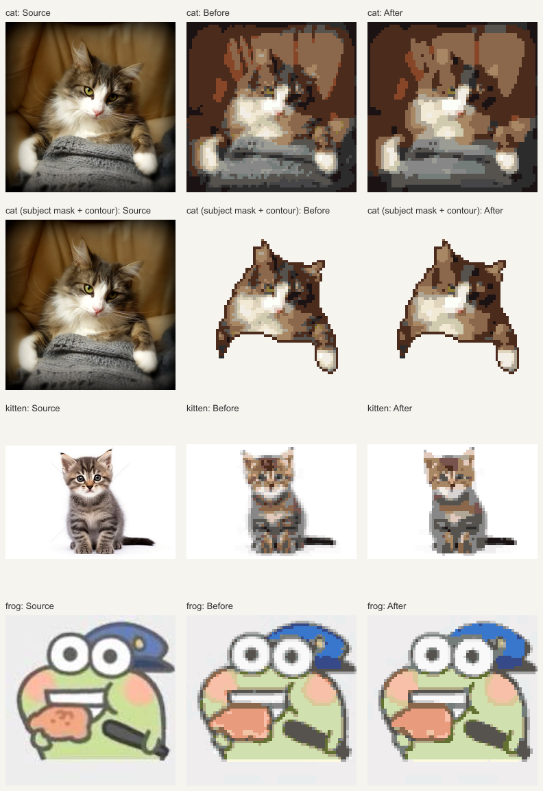

# MARD 291 配色协调性修复

用户确认此前满意的色卡为 MARD 291。本次修复其生成结果变碎、相邻近似色显得杂乱的问题；算法版本更新为 `0.10.1-mard-color-coherence`，MARD 策略版本为 `mard-single-ink-source-fill-v2`。

## 定位结果

对照 `c0c3e7c` 与修复前 `fcf7e81`，MARD 色卡 RGB 和 `color.ts` 没有变化，未发现色号选择器错位。旧版对整个区域做较强归纳，色块统一但会丢失原图细节；近期源码保色改动使结果更接近逐格原图，同时过度保留了细微色调变化。

两个后处理条件叠加导致去噪失效：

1. `StructurePlan` 按色调分箱拆分区域；原保护规则把 `boundaryStrength >= 0.25` 的格子全部硬锁。跨过一个明度分箱就可能满足条件，并不等于真实五官、条纹或主体部件边界。
2. 清理完成后，逐格保真约束把额外 ΔE00 超过 2 的变化恢复为原匹配，又重新放回了不少孤立近似色。

固定图片、尺寸、色卡、20 色预算、还原风格与 Quality 清理，分别移除两项限制做消融，再比较额外 ΔE00 预算 3、4、6。全部取消限制虽然最平整，但会丢失局部颜色；本次采用保留真实特征保护、允许有界近似色合并的方案。

## 实现

- 硬保护继续覆盖已观察关键点、模板占格与保留格、细结构、形状锚点及描边。额外保护改为原始语义 region 的实际边界，要求被保护一侧来自显式、置信度至少 0.5 的 region；邻侧允许未标注或自动 fallback，因此稀疏斑点蒙版同样有效。
- 色调分箱产生的内部边界继续作为优化的软证据，不再全部锁死。
- 身体清理的额外逐格 ΔE00 预算由 2 调整为 6。超预算仍恢复原匹配；这是相对清理前匹配的额外误差上限，不是成品整体色差上限。五官和描边不由此步骤重新着色。
- 单色深描边、H7 自动填色排除、原色卡 RGB、材料用色上限及主体占格规则继续沿用。新增语义边界保护只在结构版 MVP 生效，A0/A1 比较基线沿用原逻辑；Perler 与通用色卡的配色策略不受这项 MARD 改动影响。

## 视觉与颜色结果

输入先缩至 256 像素以内，输出固定为 64×64。下表无语义路线均采用保色、关闭描边、全图、最多 20 色；最后一行复用仓库猫图的预计算主体蒙版并开启描边。数字相对相同格网采样后的源图计算。

| 样例 | 孤立单格：修复前 → 后 | 平均 ΔE00：修复前 → 后 |
|---|---:|---:|
| 沙发猫照片，全图 | 248 → 66 | 7.083 → 7.389 |
| 小猫照片，全图 | 273 → 84 | 2.075 → 2.340 |
| 青蛙插画，全图 | 420 → 179 | 3.996 → 4.216 |
| 沙发猫，主体蒙版及描边 | 135 → 45 | 8.669 → 9.075 |

三张全图的孤立单格减少约 57%–73%，平均 ΔE00 增加约 0.22–0.31。改进是色块连贯与协调性，不宣称原图色差数值下降。合成全图 body 语义输入重复相同对照，结果保存在 JSON 中；它仅验证规划分支，不冒充神经模型评测。



真实浏览器同时检查默认候选、还原候选、MARD 单色描边、色卡切换与导出。主体占格在对照脚本中逐格核对一致。未标注的低对比细节仍可能被合并；重要斑点和五官应有可信语义证据或手工关键点。本轮不是实物测色或所有题材的完整质量门禁。

## 复现

对照脚本完全在本地运行，不调用模型、不上传图片。先从修复前提交建立只读源码快照并编译，再比较当前构建：

```powershell
pnpm build
New-Item -ItemType Directory -Force output/color-harmony/baseline | Out-Null
git archive fcf7e81 packages/pattern-core tsconfig.json -o output/color-harmony/baseline.zip
Expand-Archive output/color-harmony/baseline.zip output/color-harmony/baseline -Force
node node_modules/typescript/bin/tsc -p output/color-harmony/baseline/packages/pattern-core/tsconfig.json
node scripts/compare-color-harmony.mjs --baseline output/color-harmony/baseline/packages/pattern-core/dist/index.js --label comparison
```

产物写入被忽略的 `output/color-harmony/<label>/`：对照图、单张像素图、输入 SHA-256、版本、参数、图纸、阶段颜色指标和完整最终指标。省略 `--baseline` 可检查当前版本。主体案例复用 `sample-cat-mask.png`，不重新推理。

14 项 MARD 专项测试包含近似色合并、两条规划路线的灰点去噪与暗条纹、完整/稀疏语义身份标记、真实 observed 眼嘴模板、保留格与轮廓不被清理改写，以及 A1 比较基线隔离；新增噪声、标记与基线隔离回归均验证过修复前失败、修复后通过。

验证：`pnpm test` 共 755 项通过，其中核心 435 项；补充 A1 基线隔离后，核心完整 436 项再次通过。`pnpm typecheck`、完整构建与 `git diff --check` 通过。浏览器四个场景通过：MARD 单色描边/24 色兼容、三套色卡及导出、明暗策略/零强度导出、倾斜眼模板及独立轮廓控件。明暗导出用例明确选择确定性路线；不完整模型 fixture 的质量阻断继续由五官用例验证。

MARD 浏览器用例首次在并行视觉预览时初始生成等待超过 30 秒；关闭预览后独立重跑通过，整个场景耗时 30.5 秒。默认自动尺寸/风格搜索在本机负载下仍可能耗时数十秒，本轮不将该结果宣称为性能门禁通过。拉取后构建并刷新 `http://127.0.0.1:4173/apps/demo/`，重新生成才能应用新策略。
