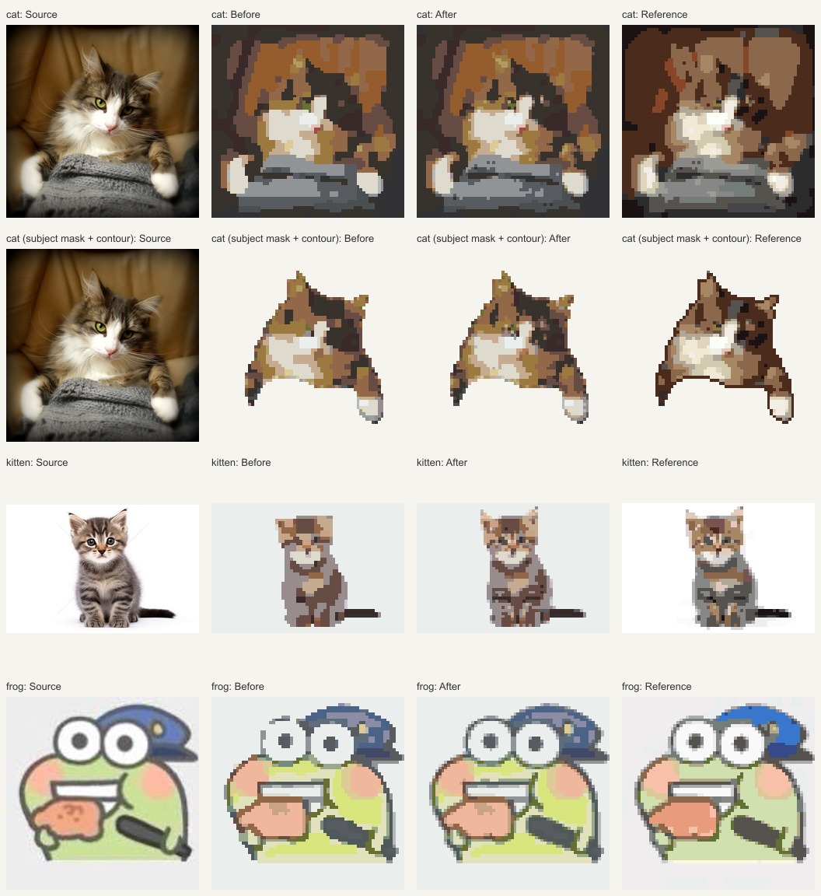

# Perler 123 配色与细节修复

反馈中的问题色卡是新加的 **Perler 123**；**MARD 291 是此前满意的参照**。前一轮误将参照当作问题色卡，先完成了 MARD 的近似色协调性修正。本轮针对 Perler 的额外偏色和细节合并，算法版本为 `0.10.2-perler-color-fidelity`。

## 已确认的问题

1. 基础去噪、邻域配色和 Quality 精修可以把小面积黑色条纹、白色亮点改成周围的大色块。Perler 没有 MARD 的逐格保真上限，合并后不会恢复。32×32 的实际 Perler 灰底、黑条纹和白点测试在普通/语义路线均失败。
2. 语义路线即使选择保色，也允许结构取色位置移动最多 0.35 格；跨过细条纹时会先混入邻格颜色。仅增加精修后的保护仍不能通过语义路线测试。
3. 登记色域本身有局限：Perler Black 是 `[50,50,52]`、White 是 `[234,239,238]`，屏幕上的黑白对比会比近纯黑/白弱。这与“123 个色号登记正确”是不同问题，不能靠增加本张用色数解决。

数据复核没有找到色号错位或导入错误：123 个 SKU 唯一、RGB/HEX 一致，118 个普通色参与自动匹配。95 项 RGB 与固定版本上游 CSV 逐项一致；28 张官方色样照片的 SHA-256 与冻结记录一致，按导入算法重采样得到 28/28 相同 RGB。透明、夜光、金属和珠光 5 项继续排除。本次保持所有登记 RGB，不声称它们是实物校准值。

## 修复与视觉选择

- 在 Perler MVP 流程中约束清理带来的逐格额外 ΔE00，超过 4 就恢复清理前的已匹配颜色。它是相对本次规划/量化结果的误差增量，不能解释为最终总色差小于 4。
- 保色或明暗强度为 0 时，Perler 的结构取色位置保持原位。需要增强的风格仍沿用原来的结构位置规则；轮廓、模板位置与颜色有独立流程。
- 可信语义边界、小范围身份标记、五官模板占格/保留格和轮廓继续受保护。普通与稀疏语义蒙版都做了回归。
- 视觉比较额外误差预算 2、4、6：2 会恢复较多碎点，6 对小细节的保留较弱，选择 4。MARD 继续使用原来的 6，不改变单色深描边和 H7 填色排除；通用 24、A0/A1 不进入本次 Perler 修复。

固定输入先缩至最长边 256 像素，64×64、还原风格、保色、最多 20 色、Quality、全图且关闭描边。下表是原图到最终图纸的平均 ΔE00，降低表示更接近原图屏幕参考颜色：

| 输入 | Perler 修复前 | Perler 修复后 | MARD 291 参照 |
| --- | ---: | ---: | ---: |
| 猫照片 | 9.296 | 9.004 | 7.389 |
| 小猫照片 | 5.547 | 5.081 | 2.340 |
| 青蛙插画 | 5.768 | 5.126 | 4.216 |

语义路线分别为 9.254→9.001、5.791→5.079、5.661→5.115；猫的现有主体蒙版/完整描边路线为 9.708→9.378。所有前后对照的主体占格完全相同，均满足 20 色预算且只用可自动匹配的实物色号。



修复前全图结果的孤立格仅 0–4 个，但也失去了眼睛、条纹和插画小色块。修复后恢复部分独立细节，不能再把“孤立格越少”单独当作质量提升。图中额外保留一行猫的现有主体蒙版/完整描边路线；蒙版本身未在本轮修改。

## 复现与验收范围

以修复前提交 `0f970e8` 的编译产物作为 baseline；可以将该提交的 `packages/pattern-core` 和根 `tsconfig.json` 用 `git archive` 解包到 `output/`，按核心构建配置编译后传入以下路径。运行脚本前先构建当前核心与色卡。

```powershell
node scripts/compare-color-harmony.mjs --palette perler-123 --reference mard-291 --baseline <旧版 dist/index.js> --label perler-before-after
```

脚本记录原图 SHA-256、配置、算法/色卡版本、完整图纸和颜色阶段诊断，检查占格一致、材料合法和用色预算；全部过程产物写入忽略的 `output/color-harmony/`。全帧语义证据为合成蒙版，用于比较代码路径，不代表神经识别质量。MARD 参照的颜色/占格指标与上一轮保持一致。

5 项 Perler 专项回归覆盖普通/语义路线的黑白细节、完整/稀疏身份标记，以及 A0/A1 隔离。核心完整 441 项、色卡 12 项与全项目类型检查通过。

三个现有浏览器场景通过：三套色卡切换与 PNG/CSV/JSON 导出（19.5 秒）、明暗策略与真正零强度（36.6 秒）、MARD 单色深描边与通用 24 兼容（17.5 秒）。另外在实际本地 Demo 上检查 Perler 的 64×64/Quality/保色结果，控制台零错误/警告，下载 JSON 为新算法版本、20 色、4096 格，材料计数与网格一致。`git diff --check` 通过。

当前仍缺少反馈者当时的具体失败图片和配置；本轮定位、修复的是可重复的算法缺陷，未完成全部题材的质量门禁或实物颜色校准。屏幕参考库在部分黑白/灰阶/亮黄上的差距仍存在，不能承诺 Perler 123 与 MARD 291 生成相同色彩。
