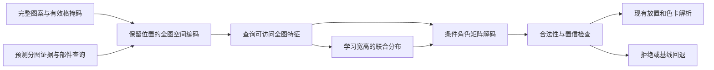

# 全图感知与自适应尺寸的五官模板生成计划

更新：2026-09-29。状态：**方案评审稿，尚未实施**。本版按用户确认的“最多 64×64 拼豆格的完整图案、根据分图输入学习模板宽高与内容”重写。

目标：训练一个五官模板生成模型，观察完整图案及其分图证据，针对指定的眼、鼻或嘴，自己决定输出矩阵的宽、高和逐格颜色角色，使模板保留被识别部件的形状、比例、表情和局部配色关系，并改善最终拼豆图纸。

规则提取、现有 35 个模板、模板检索和排序保留为对照与回退。**它们不能代替本专项的“学习式尺寸与内容生成”交付。** 数据或效果未达标时记录实验未完成或失败，不将回退方案改名为生成模型。

入口：[计划目录](README.md) · [产品实施总计划 P0–P10](contours-features-editing-perler-123-plan.md)。本轮只修订计划，不运行分图、标注或训练。

## 1. 已确认的目标与任务口径

| 项目 | 本版确定的含义 |
| --- | --- |
| 感知范围 | 完整有效图案宽 `W≤64`、高 `H≤64`，单位为拼豆格；每个部件预测都可以利用全图空间信息 |
| 输入不是整张网页图纸 | 标题、图例、署名先从模型输入视图中分离；完整原图和来源仍保留。这里“全图”指完整图案，不是只裁出某一只眼 |
| 输入形状 | 矩形保持实际比例，必要时补齐到 64×64 张量并附有效区域 mask；补齐不放大图案、不增加实际格数 |
| 模型输出 | 每个候选包含自行预测的 `width / height`、对应角色矩阵、占用／保留底色信息、局部锚点和置信信息；也允许 `no_template` |
| 尺寸来源 | 从全图、目标部件查询和分图证据学习。3×3、4×5 只是可能结果，不由调用方预设，也不只在手写尺寸表中挑选 |
| 相似目标 | 与分图识别后经过审核的部件，在共同格坐标中保持结构、比例和角色关系；原始错误蒙版不能直接当最终真值 |
| 上游模型 | 固定 GroundingDINO Tiny + SAM 2.1 Small；其高分辨率识别输入不受模板模型 64×64 格输入上限约束 |
| 首版部件与对象 | 眼、鼻、嘴；动漫插画为主要效果域，真人和动物单独评估。眉毛／眼镜先作为上下文或遮挡信息 |
| 几何约束 | 画布范围、用户锁定、邻域间隔和资源上限限定合法空间；不以规则框宽高替代模型的尺寸预测 |
| 左右与缺失 | 左右使用图像坐标，独立眼部允许未知侧；原本未画、遮挡、未检出、未知分别记录，不镜像补齐五官 |
| 首轮运行方式 | 先离线回放完整输入，验证模型每次确实预测尺寸和内容；验证通过后接入输入条件生成接口。固定生成一套库再检索只能算对照 |
| 覆盖边界 | 新模型首先服务有效画布不超过 64×64 格的输入；现有产品的 96 格能力继续保留，走原流程，不因此缩小产品画布上限 |

1–8 格宽高可作为常见部件的数据统计桶，**不是输出尺寸上限或固定候选表**。学习宽高可以不同，两眼可以采用不同尺寸。模型未见过或证据不足的尺寸需要单列泛化结果，不能靠无限放大模板取得相似分。

### 专项阶段与总体计划的关系

下表统一维护 FT 状态；每一步的操作和产出见第 6 节。

| 阶段 | 目标与主要产出 | 对应总计划 | 状态 |
| --- | --- | --- | --- |
| FT0 | 冻结全图输入、可变尺寸输出、监督与评测协议 | P0 | 待实施 |
| FT1 | 验证图纸读格、分图及尺寸真值；交付小样本报告 | P0/P3 | 待实施 |
| FT2 | 建立保留全图的训练数据、可变尺寸标签及独立切分 | P0/P3 | 待实施 |
| FT3 | 冻结直接提取、规则、检索与固定尺寸对照 | P3/P9 | 待实施 |
| FT4 | 训练全图感知、宽高与矩阵联合生成模型并完成消融 | P9 | 待实施 |
| FT5 | 验证接口、三套色卡最终效果、兼容和回退 | P3/P9/P10 | 待实施 |

主线为 FT0 → FT1 → FT2 → FT3 → FT4 → FT5。FT3 不要求先训练出另一个合格排序模型；它提供可重复、可公平比较的基线。分图准备可独立于编辑器进行，训练与发布继续遵守总计划适用的配色与质量门禁。

## 2. 可行性、现有基础与关键缺口

这一路线可行，但必须区分三个问题：**看全图、学尺寸、生成相似结构**。仅扩大输入图片而仍用很小的局部感受野，不能算全图感知；先用规则裁成 3×3 再让网络填色，不能算尺寸学习；将任意输出拉伸到目标大小后算相似，也不能证明尺寸正确。

已有基础如下：

- [当前模型配置](../../services/sam2-sidecar/src/sam2_sidecar/contracts.py)固定 Tiny + Small；[部件处理](../../services/sam2-sidecar/src/sam2_sidecar/parts.py)已提供眼鼻嘴蒙版及几何证据。接入与验证范围见[模型服务说明](../../services/sam2-sidecar/README.md)，尚未证明在本批图纸上达标。
- [图纸参考集](../../tools/bead-dataset/README.md)有 2,435 张有效图片，确认动漫脸部 115 张、眼部 23 张。题材目视核对不是五官、角色或尺寸真值；多数扩充图纸的格数尚未解析，符合 ≤64×64 格条件的数量仍需清点。
- [现有模板接口](../../packages/pattern-core/src/planning/feature-template.ts)已有宽高、锚点和逐格角色，[规则库](../../packages/pattern-core/src/planning/feature-template-library.ts)有 35 个模板，后续可复用颜色解析、姿态放置与双眼联合搜索。
- 数据资格当前全部记录为 `authorizationStatus: pending`、`trainingEligible: false`。派生数据继承来源状态；可用训练集应单独筛选，必要时补自绘或已确认可用的样本。

Grounded-SAM-2 组合开放词汇检测和提示分割，适合提供候选证据；它不直接输出可制作的颜色角色矩阵，也没有在本数据集上的五官精度保证。[官方流程](https://github.com/IDEA-Research/Grounded-SAM-2)、[SAM2](https://github.com/facebookresearch/sam2)。

有两个需要预先处理的收益风险：

1. **已有图纸本来就包含答案。** 若逐格读取与分图足够准确，按部件框直接提取可能已很好。必须把直接提取列为基线；网络更复杂并不自动更好。
2. **图纸重建不等于真实转换。** 从成品豆图中还原模板可学尺寸和形状先验，但要证明改善照片／插画的生成效果，仍须真实输入与审定目标的配对数据。两类任务分别训练、分别报告。

## 3. 模型输入、输出与架构设计

### 3.1 完整输入与目标部件查询

拟定输入为以下几类数据，实际 schema 在 FT0 冻结：

| 输入 | 含义与要求 |
| --- | --- |
| `patternGrid` | 完整 `H×W` 图案的 RGB／占用等输入特征，`W,H≤64`；不先裁成眼睛或嘴巴小图 |
| `validGridMask` | 区分有效格与 padding。画布空白和张量 padding 是不同概念 |
| `segmentationEvidence` | 从上游预测映射到同一格坐标系的主体、脸和部件 mask／框、置信度及可见性证据 |
| `partQuery` | 部件类型、主体／脸／部件实例 ID 与查询位置，明确这次生成哪一个部件；独立眼部也有独立查询 |
| `constraints` | 当前有效画布、可用占格／用色预算、保护格、相邻五官和手动锁定；不包含正确输出宽高 |

完整图像分支保留其他眼睛、脸型、头发、姿态等上下文。目标 mask 用来指明关注对象，不将 mask 外的图案全部置零。可以从全图特征中提取局部细节作补充，但每个部件都必须有访问全图的通路。

超过 64 格的原始设计先标为范围外，不通过截取一个 64×64 局部窗口冒充全图。若后来构造 ≤64 格的新设计版本，应重新审定分图、尺寸与矩阵，并与原设计归入同一来源组；不能仅缩小 PNG 后沿用旧标签。首版不自动训练这类未经核对的派生版本。

### 3.2 首轮网络方案

首轮建议采用**小型多尺度 CNN 空间编码器＋面向部件查询的全图特征汇聚＋尺寸头＋角色矩阵解码器**。以下为拟定设计，不代表现有实现。



全图汇聚可采用查询对带二维位置信息的空间特征进行注意力汇聚，同时保留高分辨率格特征供解码。仅使用全局平均颜色会丢失空间关系；仅叠少量局部卷积也不能据此声称整个 64×64 输入都参与预测。FT4 检查实际特征路径，并用全图／局部消融验证。

先验证这一种小模型，不同时铺开大型扩散、多个 Transformer 或上游分割微调。模型大小、内存和延迟由试验实测，不预先承诺。

### 3.3 宽高和内容联合学习

1. 尺寸头学习 `p(w,h | 全图、分图、部件查询、约束)`；可用联合分类或条件分解 `p(w)·p(h|w)`，避免独立预测两个边长却组合成不合理比例。
2. 对有效模板，整数范围为 `1≤w≤W`、`1≤h≤H`，再检查边界／保护／间隔等硬约束；这只是合法范围，不是从分图框直接指定答案。不存在可用部件时输出独立的 `no_template` 决策，不导出 0×0 的无效模板。
3. 解码器根据预测宽高和同一份全图证据生成对应角色矩阵。批处理可内部 padding，但导出矩阵的逻辑尺寸必须等于模型预测的尺寸；不能统一生成固定矩阵再由规则裁切出“预测宽高”。
4. 首轮每部件最多返回 4 个完整候选，候选包含宽高和内容；候选预算统一，不让可变尺寸路线因多出几十个备选而获得不公平优势。
5. 对非法或低置信候选予以拒绝或回退，记录原因；不能静默缩放、剪裁或改成常用尺寸后仍将其统计为模型原始成功。

输出契约至少包括 `width / height / cells / anchor / confidence / sourceVersions`。材料品牌色号继续由现有颜色角色解析器产生；生成器不负责凭空增加整张脸或修改主体位置。锚点沿现有坐标约定，须在模板范围内；放置阶段尊重上游姿态与手动锁定。

线上校验只使用输入证据和合法约束；与审定目标的相似性属于离线训练／评测，不要求推理时取得人工真值。共同坐标评测以输入中的部件实例和预测锚点确定放置，不能通过搜索最佳对齐位置或使用目标锚点消除模型的位置误差；给定真值位置的结果只列作诊断。

### 3.4 输入标签隔离

分图输入使用推理时实际能取得的预测蒙版、框和分数。审定矩阵、正确宽高和人工修正后的答案保存在监督字段，不能拼进模型输入。人工确认的框只有在对应产品模式确实允许提供时才能作为该模式输入，评测时单列。

成品图纸本身含有局部答案，是图纸重建任务的已知条件；因此必须和直接提取比较。真实转换任务的输入必须取自应用模板之前的图案／图像规划阶段，不能输入已包含人工修正结果的成品，再声称能够修正原始生成。

## 4. 数据处理与可变尺寸真值

### 4.1 读格和分图流程

1. 从完整原图确认图案面板，保留标题、图例、署名及坐标变换的来源引用；不修改原始文件。
2. 识别方格行列、格距、相位、占用和颜色，采样珠粒实色区域，避开豆孔／网格线；白珠与空白底板分开判断。
3. 保存逐格图案及平面渲染，核查有效 `W/H`。六角板、多部件布局、范围外或无法读格样本保留原因，不混入首版方格训练集。
4. 用固定 Tiny + Small 对比原图面板、逐格还原视图及局部辅助识别；上游可以局部细分，但最终所有证据回到完整格图。完整脸与独立眼部采用适配入口，不能都依赖检出整个人物。
5. 校正多块误拆、串脸、头发与眼睛黏连和漏检；连通域不能直接决定眼数。所有裁剪保存 `sheet → panel → grid → face → part` 变换链。
6. 形成完整格图、预测证据、目标部件查询与审定模板的配对记录。不能只保存部件裁剪而丢失全图输入。

### 4.2 尺寸标签如何取得

对审定功能格集合求最小包围框，得到目标宽 `w*`、高 `h*`；眼白、高光、虹膜等有效角色都在功能格中。模板内部必要保留底色保存在矩阵内，外部安全间隔单独存储，不能通过任意外扩 padding 改变尺寸真值。

尺寸真值必须位于模型使用的同一拼豆格坐标系：原 PNG 像素宽高、SAM 浮点框、渲染放大倍数都不是模板宽高。边界角色不清楚时，尺寸标签保持未知或交由审核，不能自动把检测框四舍五入当金标准。

若几种紧致尺寸都能合理表达该部件，记录人工确认的可接受集合及各自矩阵，不强行将所有合理答案压成一种。不存在部件、遮挡与未知分别标记；不能将漏检作为尺寸为零的监督。

### 4.3 两类监督及其结论边界

| 数据类型 | 输入和目标 | 可以证明什么 |
| --- | --- | --- |
| A：图纸模板重建 | ≤64 格完整成品图案＋预测分图 → 审定部件的尺寸与角色矩阵 | 分图归纳、尺寸与形状重建能力；须对照直接提取 |
| B：真实输入条件生成 | 应用模板前的 ≤64 格完整输入＋真实可得分图 → 人工接受的局部目标及尺寸 | 对实际转换任务的改善；最终以完整图纸评价 |

A 可用于先训练并检查模型通路。只有 A 的良好重建成绩时，模型仍是重建实验，不能宣称照片／插画转换提升。B 需要补配对输入或针对固定输入的人工局部修正；随机给不同尺寸贴“更好”标签没有监督意义。

### 4.4 必须保存的字段

| 字段组 | 产出内容 |
| --- | --- |
| 来源与资格 | 图纸 ID、作者、URL、原图 SHA、使用范围、审核方式／人员和版本 |
| 分组与切分 | 原设计、近似设计、已知身份／角色、A/B 任务类型和 train/validation/test |
| 全图输入 | `W/H`、完整格图、占用／有效格掩码、来源到格图的变换与预处理版本 |
| 预测证据 | 主体／脸／部件实例及映射蒙版、框、置信度、可见性、模型 revision 和提示设置 |
| 目标 | `w*/h*` 或可接受尺寸集合、角色矩阵、未知格、锚点、安全间隔、目标在全图中的对应范围 |
| 审核轨迹 | 原始预测、校正差异、接受／拒绝／不适用原因和人工耗时 |

先分组再切分，再从训练组提取原型和训练统计；同图左右眼、裁剪、镜像、换色、缩放或重新设计版本不能跨集合。测试部件不能提前进入检索库。原型参考可选，纯生成路线不能依赖检索到测试答案。

## 5. 训练目标、验证与发布条件

### 5.1 损失与训练组织

拟联合优化尺寸监督、角色／占用、边界结构、锚点及相似性，权重在开发集冻结：

- **尺寸**：监督宽高联合分布，并报告边长／面积误差；可接受尺寸集合允许多个正确解。不要用“越小越好”的正则把所有眼睛压成 1×1。
- **内容**：按角色和占用计分，未知格屏蔽；背景／padding 不主导平均分，高光等少数角色单独统计。
- **结构相似性**：将预测模板按合法坐标放回共同全图，与审定分图比较功能格、轮廓、比例与角色分布。保留只比较原始预测和比较最终放置两组结果，定位尺寸、锚点或放置错误。
- **硬约束**：边界、角色、占格、保护、间隔在解码后校验；低训练损失不替代合法性检查。

初期可在部分训练步骤用正确尺寸帮助内容分支收敛，但主验证必须由模型自行预测尺寸。随后加入预测尺寸条件下的训练／评估，避免“给对尺寸时很好、自由预测时崩溃”。尺寸不符时使用共同坐标监督，不能把目标矩阵任意拉伸去迁就预测。

建议以至少 300 个独立来源组、2,000 个审定部件作为较完整试验的标注预算参考；不是理论最低样本量，也不是当前已拥有的数据。先做小样本学习曲线，分别统计主要尺寸、表情、可见性和 A/B 域覆盖；独立来源不足时缩小实验结论或补数据，不以增强数量凑门槛。

### 5.2 固定对照与消融

所有路线使用同一输入、分图、色卡、最终画布和用色预算；候选上限相同并报告实际数量，单候选基线不通过重复候选凑数。统一报告 Top-1 与同上限候选结果，测试集不参与调参。

| 编号 | 对照 | 要回答的问题 |
| --- | --- | --- |
| B0 | 按分图格框直接提取／直接投影 | 简单读格是否已经足够，网络是否只学会复制 |
| B1 | 现有 35 模板＋原规则 | 相对当前产品是否改善 |
| B2 | 训练组提取的模板库＋检索 | 新结构生成是否超出记忆／检索的收益 |
| M0 | 同一网络，仅局部输入＋学习尺寸 | 全图上下文有无贡献 |
| M1 | 全图输入＋固定尺寸或框尺寸规则 | 学习尺寸有无贡献 |
| M2 | 全图输入＋学习尺寸＋角色矩阵生成 | 本专项主模型 |
| D0 | M2 使用审定尺寸／审定证据 | 仅作诊断上界，不能作为主模型成绩 |

全图分支的检查既包含架构可达性，也包含受控遮蔽／局部对照：保持目标部件证据，观察姿态和相邻五官等相关上下文的影响。不是所有图片都必须因远处无关像素变化而改变输出；不奖励随意依赖背景。

在开发集上确定 B0/B1/B2 中用于发布判断的主要对照，并冻结选择和主目标组；独立测试同时展示全部基线。不能在测试后挑选最弱对手，或只汇报模型胜出的尺寸桶。

### 5.3 指标与通过条件

下列数值是首轮拟议门槛，在 FT0 冻结；样本数和来源组置信区间必须同时报告，不按封存集结果临时放宽。

| 层次 | 指标和条件 |
| --- | --- |
| 读格 | 自动接受方格的占用／颜色索引一致率目标 ≥99%；逐图报告及白珠／空白混淆单列 |
| 预标注 | 自动接受候选 Precision ≥95%、可见且可表达部件 Recall ≥80%；同时报覆盖率和失败分母 |
| 整理成本 | 同难度组预标注＋校正的人工耗时中位数比纯人工降低 ≥30% 为扩批成本目标；不满足时采用半自动小批路线 |
| 全图输入 | 每个查询都具备访问全部有效格的特征通路，padding 不参与有效统计；附 M0/M2 对照和空间诊断 |
| 学习尺寸 | 报 Top-1 可接受尺寸率、宽高 MAE/P90、面积和比例误差、各尺寸桶混淆；主目标组可接受尺寸率目标 ≥90%，宽／高绝对误差 P90 各 ≤1 格，单格部件单列准确率 |
| 结构相似 | 在共同格坐标中报功能格 F1、角色宏 F1、边界和锚点误差；首轮审定重建的功能格 F1 目标 ≥0.90，角色稀疏组和宽高错误不能被背景均值掩盖 |
| 模板合法性 | 导出宽高等于模型有效预测宽高；角色、边界、锚点和预算校验全部通过，非法候选数及拒绝率另报，不能只统计幸存者 |
| 最终五官 | 沿用五官 gate：眼 Top-2 接受率 ≥90%、嘴 ≥85%、可表达硬特征完整可见率 ≥95%、硬碰撞 0；另报 Top-1、鼻、错误表情、无依据新增 |
| 真实改善 | B 类独立组对冻结主要对照盲评，记录胜／平／负；净胜差的按来源组自助采样 95% 区间下界 >0，且硬约束无退化；A 类自重建成绩不替代此项 |
| 兼容与成本 | 24／123／291 分别报告颜色、结构、精修后可见性、速度、显存和回退率；范围外画布继续通过原流程回归 |

至少保留原协议的 30 个独立人物输入、32／48／64 格回归，增加动漫主目标、非方形画布、倾斜、闭眼、遮挡、多脸和独立眼部组。96 格走现有流程，验证兼容，不宣称由新模型处理。数量不足的组标记证据不足；不可见、不可表达、未检出分别计数，并附全部输入的总体成功率。

## 6. 小样本验证与分阶段交付

### 共用产物与记录方式

以下路径均为拟定产物，当前未创建。每次运行使用独立的 `output/template-learning/<runId>/`：

```text
meta/       任务、模型、输入输出契约、来源清单、分组与评测协议
pilot/      读格／分图视图、尺寸金标准、小样本预测和校正记录
dataset/    全图配对数据、变长矩阵、A/B 清单、切分与模板图鉴
baselines/  直接提取、规则、检索和固定尺寸对照
learning/   全图编码、尺寸／内容模型、训练配置、权重与诊断
reports/    分层指标、消融、盲评、资源、失败归因及推进结论
release/    版本包、接口兼容清单和回退记录
```

每个阶段记录输入／配置哈希、上游产物、模型／色卡／标签版本。每张图都有成功、拒绝、不适用、待审核或运行失败状态及原因；可见性、使用范围和质量状态分别存储。缓存只复用版本一致的成功产物，不能覆盖原图或人工校正。

### FT0：冻结全图与可变尺寸任务

**输入**：现有清单、固定模型、模板接口及本计划。**目标**：明确什么输入、输出和标签才代表用户要求，冻结成功判据。

| 步骤 | 操作目标 | 产出 |
| --- | --- | --- |
| FT0.1 | 固定 ≤64×64 格、矩形／padding、全图与分图坐标；记录目标部件查询和范围外处理 | `meta/task-contract.md`、输入输出 schema 草案 |
| FT0.2 | 核对 Tiny + Small 的固定 revision、依赖、缓存和设备；实施时区分未启动、冷加载和推理失败 | `meta/runtime.json`、最小可运行记录 |
| FT0.3 | 按有效 manifest 清点已知真实格数、布局、来源资格及设计组；不能用 PNG 尺寸判定 ≤64，未解析项留给 FT1 | `meta/inventory.jsonl`、范围内／范围外／未知数量 |
| FT0.4 | 确定人工审核者、尺寸与角色标注口径、A/B 任务、开发／封存分组及第 5 节门槛 | `meta/evaluation-protocol.md`、冻结清单 |
| FT0.5 | 定义批量、超时、重试、显存、磁盘和审核预算，未测性能保持待测 | `meta/run-config.json`、就绪和缺口报告 |

**通过条件**：输入单位和坐标一致、模型最小可运行、审核／评测方法确定。**预案**：没有人工真值时先验证记录和读格工具；没有合格训练样本时训练清单明确为空，不推进权重训练。

### FT1：验证分图及尺寸真值

**输入**：FT0 协议和分组图纸。**目标**：确认能从完整图案可靠取得部件、尺寸和角色，测出自动化是否节省整理成本。

沿用约 240 张清点／提取试验预算：138 张脸／眼优先图，再选 62 张动漫人物和 40 张动物；这是清点前的名义配额，不保证全部符合 ≤64 格。实际范围内数量按读格结果报告；范围外、六角板和无法确认项保留在总体分母，不缩图凑配额。独立组开发／封存目标约 160／80，实际分组后调整并记录。

| 步骤 | 操作目标 | 产出 |
| --- | --- | --- |
| FT1.1 | 从开发集约 24 张建立标注范例，确认边界、白珠、角色、左右、缺失和紧致尺寸定义 | `pilot/gold.jsonl`、歧义案例与标注说明 |
| FT1.2 | 比较面板与平面读格，核验全图 W/H、占用、格距和相位，确认输入范围 | `pilot/views.jsonl`、格点叠图、坐标误差清单 |
| FT1.3 | 比较原页／面板／还原图的分图结果，区分检头、检部件和蒙版错误；证据统一回全图 | `pilot/predictions.jsonl`、查询与分图叠图 |
| FT1.4 | 校正部件角色与紧致尺寸，记录原预测和审定目标；检查纯眼图、多脸和不对称样例 | 宽高／矩阵配对、校正日志和人工耗时 |
| FT1.5 | 开发集冻结处理配置后评估封存组，报告预标注、尺寸标签可靠性与成本 | `reports/ft1-metrics.json`、失败图集 |
| FT1.6 | 决定哪些布局自动候选、半自动处理或暂缓，并估算范围内可用数据量 | `reports/ft1-decision.md`、全量处理建议 |

**通过条件**：读格和预标注达到对应门槛，尺寸标签能被一致解释。**预案**：读格不可靠就暂停模板导出；分割不可靠但人工框／点有效时改半自动。封存样例被用于调参后降级为诊断集，重新补独立测试。

### FT2：建立全图到可变尺寸模板的数据集

**输入**：FT1 选定路线与审定样本。**目标**：保留完整输入并形成可训练的宽高、角色及相似性监督。

| 步骤 | 操作目标 | 产出 |
| --- | --- | --- |
| FT2.1 | 先按原设计、近似版本与已知身份分组，冻结 train/validation/test，优先 60/20/20；继承 FT1 封存组隔离，禁止重切分后流入训练／验证集 | `dataset/groups.jsonl`、切分与泄漏报告 |
| FT2.2 | 按约 100 张来源的小批保存完整格图、预测分图与目标查询，确认没有只留裁剪图 | 全图实例、有效 mask、变换及证据清单 |
| FT2.3 | 审核变长角色矩阵、紧致宽高、锚点和合理多解；未知标签屏蔽并保存校正差异 | `dataset/targets.jsonl`、矩阵文件、尺寸分布与反例 |
| FT2.4 | 分别构建 A 类图纸重建和 B 类真实转换；B 输入来自人工修正／模板应用之前 | A/B 配对清单、采集缺口与监督说明 |
| FT2.5 | 按资格与质量导出可训练集，并仅从训练组构建用于比较的模板原型库 | 合格清单、模板图鉴、各域／尺寸桶来源组数 |

**通过条件**：尺寸和矩阵同坐标、输入无监督字段泄漏、分组独立且使用范围明确。**预案**：少数角色占比过大时补稀缺设计；B 不足时只报告 A 任务实验；审核积压或错误率超预算时暂停扩批。镜像／换色不能增加独立来源计数。

### FT3：冻结对照与失败基线

**输入**：FT2 数据、现有模板和生成流程。**目标**：确定直接提取、规则和检索能做到什么，以及全图／尺寸学习应改善什么。

| 步骤 | 操作目标 | 产出 |
| --- | --- | --- |
| FT3.1 | 实现可回放的 B0 直接提取／投影，保存预测框与正确框的诊断差异 | 直接提取候选、尺寸／内容误差 |
| FT3.2 | 冻结 B1 规则和 B2 检索；候选上限、颜色、画布和分析证据一致 | `baselines/configs.json`、模板／代码版本 |
| FT3.3 | 为 M0/M1/M2 设定同一模型容量与训练预算，区分全图收益与尺寸收益 | 消融协议、预算与数据引用 |
| FT3.4 | 固定人工接受／拒绝和盲评方式，允许无模板及全部拒绝 | 评价记录格式、基线图纸与失败分类 |
| FT3.5 | 冻结对照指标与发布条件，定位 B 类未解决的尺寸／结构问题 | `reports/ft3-baseline.md` |

**通过条件**：对照可重放且公平，不要求先训练另一个排序模型。**预案**：若 A 上直接读取已接近完美，保留该事实，将改进重点放到有真实误差的 B 类任务；不人为削弱基线。

### FT4：训练全图感知与尺寸／内容联合模型

**输入**：冻结的全图配对数据、合法约束与对照协议。**目标**：由分图输入和全图上下文自行生成宽高及相似结构。

| 步骤 | 操作目标 | 产出 |
| --- | --- | --- |
| FT4.1 | 建立全图空间编码和部件查询，验证矩形、padding、多个部件及全部有效格的访问路径 | 模型结构、张量／坐标说明、全图通路检查 |
| FT4.2 | 学习宽高联合分布及 no_template，报告尺寸分布、比例偏差、单格与稀疏尺寸桶表现 | 尺寸头权重、混淆表、尺寸学习曲线 |
| FT4.3 | 根据预测尺寸解码角色矩阵，联合训练内容／形状；区分给定真值尺寸和自主尺寸结果 | 联合权重、配置、损失曲线、原始预测候选 |
| FT4.4 | 跑 M0/M1/M2 和 D0 消融，在共同坐标测相似性；诊断是否只复制 mask 或记住来源 | `reports/ft4-ablation.json`、上下文与尺寸失败图 |
| FT4.5 | 在 A/B 独立组分别评估，记录效果、成本、非法率、回退与能力边界 | `reports/ft4-decision.md`、模型说明和未完成项 |

**通过条件**：结构上满足全图与自主尺寸要求，达到对应数据任务门槛；产品改善需要 B 类真实评测支持。**预案**：尺寸塌缩先检查标签／padding／损失，内容好但尺寸错先修尺寸头，给正确尺寸才有效则不得通过联合预测验收。未胜出时记录失败或实验状态，不将检索回退当作本阶段完成。

### FT5：接入与最终验收

**输入**：通过任务验收的模型、接口和回退基线。**目标**：在实际输入上执行尺寸／内容预测，且不破坏原有色卡和放置流程。

| 步骤 | 操作目标 | 产出 |
| --- | --- | --- |
| FT5.1 | 冻结可变宽高、角色、锚点、来源和版本合同，校验矩阵尺寸与模型原始预测一致 | 输出契约、模板注册／兼容检查 |
| FT5.2 | 将完整格图与分图查询接入条件生成，在实验开关下保留来源映射和候选诊断 | 推理调用记录、尺寸／内容／证据版本链 |
| FT5.3 | 复用现有姿态放置和材料色解析，检查 24／123／291 精修后效果及导出统计 | 三色卡端到端报告与阶段图纸 |
| FT5.4 | 演练 >64 格、缺证据、模型失败、非法尺寸、超时、版本不匹配和用户锁定 | `release/rollback-report.md`、原流程兼容记录 |
| FT5.5 | 冻结模型、阈值、适用域、接口、性能和复现入口，通过门禁后再考虑默认启用 | `release/manifest.json`、模型说明、交付与回退文档 |

**通过条件**：实际接口按每张输入预测宽高和矩阵，最终效果与硬约束通过，范围外输入回到原流程。**预案**：保持实验开关，按错误阶段回修；离线导出静态模板库不能替代条件模型接口交付。生成、全局候选排序和整个 P9/P10 的完成状态分别维护。

## 7. 风险、降级与停止预案

| 风险信号 | 处理顺序 | 必须保存或限制的内容 |
| --- | --- | --- |
| “全图”实际上只剩脸／眼裁剪，或只用局部卷积 | 检查数据存储与模型通路，再做 M0/M2 对照 | 完整有效格覆盖和空间诊断；未满足就不能通过全图要求 |
| 平均池化丢失关系，或模型依赖无关背景 | 保留二维空间信息、分图查询与局部细节，做相关／无关上下文对照 | 多脸、遮挡、姿态分组报告，不要求远处无关像素影响输出 |
| 输出长期固定 3×3、总趋向 1×1 或全为最大尺寸 | 检查尺寸标签、类别不平衡、padding 与损失权重；复核合法空间是否误设成唯一框 | 宽高分布、各桶误差与原始 logits／置信；不能用规则补尺寸伪装修复 |
| 宽高各自合理但组合比例错误 | 联合建模或条件分解，检查尺寸配对监督和矩形样本覆盖 | 宽高联合混淆与比例误差，不只报两个边长均值 |
| 给正确宽高时内容好，自主预测时差 | 对比 D0 与 M2，增加预测尺寸下的训练和全图坐标损失 | 自主尺寸成绩作主指标，真值尺寸只作诊断 |
| 通过拉伸、裁切或大面积空白得到虚高相似 | 使用共同全图坐标、紧致尺寸定义和功能格／角色宏指标 | 原始预测与校验后候选分开，额外修补不能算模型成功 |
| mask 漏检、黏连、一眼被拆多眼或多主体串脸 | 比较面板／平面图与查询归属，必要时人工框／点校正；上游分数不当金标准 | 保留原预测、审定差异和人工成本，自动覆盖率如实报告 |
| 图例误识别、读格错相位、白珠丢失或图片不够清楚 | 先修面板和格点读取，再做语义；缺信息不靠生成式超分造标签 | 失败样本不导出训练模板，范围与原图证据保留 |
| >64 格图直接压成 64 格，标签沿用旧尺寸 | 隔离范围外样本；如做新设计版本，重新审核完整网格、分图与标签 | 新旧来源同组，不能把缩图当作无损样本扩充 |
| 漏检被标为不存在，闭眼或遮挡被补成双眼 | 区分可见性和识别失败，保留 no_template 与未知标签 | 无依据新增作为失败，不能镜像补齐或硬指定眼数 |
| 少数角色占多数、同源跨集合或测试模板进入检索库 | 去重分组并重做切分，必要时使已报告结果失效 | 来源组数、泄漏报告及更新后的独立评测 |
| 只会重建成品图，对照片／插画无增益 | 检查 A/B 输入差异和配对监督，补真实转换局部目标 | A 实验成果可以保留，产品效果结论仍待 B 验证 |
| 尺寸正确但放置、配色或精修破坏五官 | 分别导出预测、放置、量化和精修结果，修发生错误的模块 | 不通过重训尺寸头掩盖后处理问题；按色卡单列 |
| 训练资格不足、无人工金标准、标签分歧大 | 先处理资格／审核协议，补自绘或确认可用数据；歧义项屏蔽 | 允许产出数据缺口报告，不产出宣称合格的训练成果 |
| 显存、延迟或审核积压超预算 | 单 GPU 有界队列、小批推理、缓存与断点恢复，先测量再扩批 | 保存未完成分母、资源与重试日志，不跳过错误后报全量成功 |
| 新模型不胜出或只在少数桶有效 | 复查监督、尺寸与上下文消融；限定实验范围或停止发布 | 保留可靠基线作为回退，模型专项不因此标为完成 |

停止进入训练的条件包括：不可恢复的读格错误、未明确的训练资格、未解决的监督歧义和来源泄漏。停止扩批的条件包括错误／人工积压超预算。停止默认发布的条件包括未证明自主尺寸与全图感知、缺少 B 类改善证据或硬约束退化。负结果可以结束一次实验，但必须交付可复查的失败归因与下一步判断。

## 8. 交付范围与后续边界

首轮交付应包含输入／输出与尺寸定义、全图配对数据、审定矩阵和尺寸分布、独立切分、基线、模型权重及配置、全图／尺寸消融、共同坐标的相似性评测、三套色卡最终效果和回退记录。

现有模板类型的来源、保留底色／未知角色和动态 ID 需要兼容扩展；目前没有这些新接口，不把计划文件名写成已经可运行的命令。人工校正始终优先，生成模型不绕过放置器直接改写最终图纸。

近期执行入口仍为 **FT0＋FT1**：先把 ≤64×64 格全图、预测分图输入、审定尺寸／矩阵与评测合同建立起来。FT0–FT5 当前均未实施；本轮只重写计划和关联入口。
