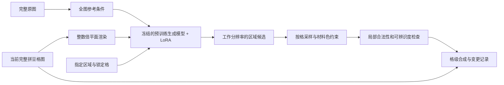

# 本地局部生成与 Adapter 开源实现调研

当前执行更正：用户后续确认保留肤色底图，按“先周边 → 蒙版铺肤色 → 局部生成”实施，详见[当前填充计划](masked-grid-fill-plan.md)。下文保留当时选型与尺度分析；双参考是后续对照，当前 v3 的必需条件是完整拼豆周边，单次最多三次尝试。

核验日期：2026-09-30。本文区分上游已提供的能力、针对本项目的工程推断和仍需实测的事项。调研之后用户确认 SDXL Inpainting＋LoRA，现已装配并完成首轮推理和 LoRA 单步诊断；这些新增实测见[实施记录](sdxl-region-implementation-2026-09-30.md)，不追溯改写为调研时已得出的结论。实施状态由[五官区域生成专项](bead-facial-template-learning-plan.md)维护。

## 1. 结论与选型顺序

任务是**看完整图像，在指定区域生成适合拼豆格网的五官**。采用已有生成模型，冻结基础权重，只训练 LoRA 等 adapter。输出为本张图的区域修改，不建立模板库，不训练模板宽高预测头。

本机通过 `nvidia-smi --query-gpu=name,memory.total --format=csv,noheader` 查得 **RTX 4070 Laptop GPU，8188 MiB 显存**。以下建议以这个资源条件为依据：

1. **本机首轮：SDXL Inpainting + LoRA。** 有原生蒙版输入、可下载权重、实际 inpainting LoRA 训练脚本，先验证最小闭环。8GB 下的训练分辨率、峰值显存和速度必须实测，不能把普通文生图 LoRA 的资源经验直接套过来。
2. **多图条件的优先升级候选：FLUX.2 klein-base-4B + LoRA。** 可同时利用完整原图、当前格图等参考；模型及训练工具公开。但公开的常规 LoRA 配方面向 24GB，不能承诺本机 8GB 训练。先测量量化／卸载后的本地推理；若资源不满足，记录限制，不自动购买或使用云服务。
3. **更重的对照：Qwen-Image-Edit-2511、FLUX.1 Fill。** 前者有较完整的多图编辑和 LoRA 工具，后者原生适配蒙版填充；均不作为本机首个训练任务。
4. **BrushNet 保留技术备选。** 它是附加分支式 inpainting，而非等价于小型 LoRA；不在第一轮同时训练多个分支。

这是实现优先级，不是拼豆质量排名。没有一个下述项目已经证明能直接生成合格的本项目五官格图。

## 2. 可核查的实现

### SDXL Inpainting：第一轮基线

- 权重：[diffusers/stable-diffusion-xl-1.0-inpainting-0.1](https://huggingface.co/diffusers/stable-diffusion-xl-1.0-inpainting-0.1)。模型卡注明 1024 分辨率训练、9 通道 inpainting UNet，输入包含 mask 和 masked image；权重标注 OpenRAIL++，不是 Apache/MIT 权重。
- 本地推理：[Diffusers inpainting](https://huggingface.co/docs/diffusers/main/en/using-diffusers/inpaint)，使用 `AutoPipelineForInpainting` / `StableDiffusionXLInpaintPipeline`，支持 CPU offload。
- LoRA 训练：[kohya-ss/sd-scripts 的 inpainting 文档](https://github.com/kohya-ss/sd-scripts/blob/main/docs/inpainting_training.md)，明确提供 `sdxl_train_network.py --train_inpainting --network_module=networks.lora`。该训练路径采用随机生成蒙版，不能同时启用 `cache_latents`。**随机蒙版训练不等于已经支持本项目的五官蒙版和修正前后配对数据**，数据读取及 mask 采样要适配。
- 冻结基础模型的实现依据：[train_network.py](https://github.com/kohya-ss/sd-scripts/blob/main/train_network.py)。本项目要求限定为 UNet 中的 LoRA，文本编码器与 VAE 不训练；执行前审计实际 optimizer 参数及训练后基础权重校验和。使用已训练的 inpainting checkpoint，不把普通 4 通道模型扩成随机初始化的 9 通道网络作为主路线。

优点是原生区域控制与较清楚的训练入口；不足是默认更偏连续图像，像素格相位、单格纯色和材料预算仍须工程处理。首先测全图 512 工作分辨率，再测 768/1024；这是省显存试验安排，不代表降低分辨率后质量不受影响。

可选的完整原图参考通道是预训练 [IP-Adapter](https://github.com/tencent-ailab/IP-Adapter)，[Diffusers 文档](https://huggingface.co/docs/diffusers/main/en/using-diffusers/ip_adapter)提供图像条件与 inpainting 用法。它与本项目训练的 LoRA 含义不同：IP-Adapter 提供图像条件，LoRA 学习局部拼豆表达。首轮可冻结 IP-Adapter，只训练 LoRA；SDXL inpainting、具体 IP-Adapter 权重和 LoRA 的联合训练／加载仍需验证。图像参考特征也不保证逐点对齐，不能替代格网坐标。

### FLUX.2 klein-base-4B：多图编辑候选

[官方仓库](https://github.com/black-forest-labs/flux2)提供本地生成与单图／多图编辑，4B 及 4B Base 使用 Apache-2.0；训练选未蒸馏的 [klein-base-4B](https://huggingface.co/black-forest-labs/FLUX.2-klein-base-4B)。9B 和 FLUX.2 dev 的许可不同，不混用其名称或条款。

训练实现为 [ostris/ai-toolkit](https://github.com/ostris/ai-toolkit)。其 [4B 文档](https://ostris.com/docs/ai-toolkit/models/flux2-klein-4b)说明 `datasets.multi_control_paths` 可提供多张参考图，并提供量化、低显存加载和线性 LoRA 路径；适合试验“原图＋格图＋区域提示”的条件组织。

资源信息存在口径差异：官方仓库概述写约 8GB，Base 模型卡写约 13GB；[BFL 的 LoRA 教程](https://huggingface.co/blog/black-forest-labs/flux-2-klein-lora)用 24GB GPU。它们不是同一精度、卸载与训练配置，均不能当作本机实测。只训练 adapter 仍然需要基础模型的前向、反向激活和参考图计算。

已查到的 [Diffusers Flux2 API](https://huggingface.co/docs/diffusers/api/pipelines/flux2)提供参考图编辑，不能据此宣称原生具有 FLUX Fill 的 `mask_image` 接口。首版若采用它，需实现区域提示及严格的格级结果合成；“只改蒙版内”的保证由合成器承担。仅靠文字“只改眼睛”不够。

### Qwen-Image-Edit-2511：语义与多图条件对照

[官方权重](https://huggingface.co/Qwen/Qwen-Image-Edit-2511)和 [Qwen-Image 仓库](https://github.com/QwenLM/Qwen-Image)公开本地 `QwenImageEditPlusPipeline` 多图编辑，权重为 Apache-2.0。这里的“一致性改善”来自官方通用展示，尚非拼豆格级验证。

[musubi-tuner](https://github.com/kohya-ss/musubi-tuner/blob/main/docs/qwen_image.md)提供 `qwen_image_train_network.py`、`networks.lora_qwen_image` 和 `--model_version edit-2511`；只选 LoRA 入口，不选全量 fine-tuning 脚本。其 1024、batch=1 资源表在较强 block swap 下仍列约 12GB，并注明 Edit 控制图另占内存、建议足够主内存；这不是 8GB 本地训练已获支持的证据。

Diffusers 另有 [QwenImageEditInpaintPipeline 源码](https://github.com/huggingface/diffusers/blob/main/src/diffusers/pipelines/qwenimage/pipeline_qwenimage_edit_inpaint.py)，但示例指向早期 `Qwen/Qwen-Image-Edit`。不能把该示例与 2511 Plus 多图版视作已经验证兼容；采用 2511 时仍要核对精确 pipeline／checkpoint 组合和区域控制方式。

### FLUX.1 Fill dev：原生 inpainting 对照

[官方模型卡](https://huggingface.co/black-forest-labs/FLUX.1-Fill-dev)提供 12B Fill 权重、`FluxFillPipeline` 和图像／蒙版输入。权重为 FLUX.1-dev 非商业许可，需按用途核对；开放权重不等于无限制开源授权。

有具体 [FLUX-Fill-LoRa-Training 实现](https://github.com/Sebastian-Zok/FLUX-Fill-LoRa-Training)，入口 `train_dreambooth_inpaint_lora_flux.py`，使用图像与同名 mask。作者明确只在 A100 80GB 测过且未优化，故本次不把它推荐成 8GB 现成训练方案。该仓库是社区 Diffusers fork，不能拿普通 FLUX LoRA 教程代替 Fill 的实测。

### BrushNet：附加分支方案

[TencentARC/BrushNet](https://github.com/TencentARC/BrushNet)公开 SD1.5/SDXL 权重与 `train_brushnet.py`、`train_brushnet_sdxl.py`。它把蒙版图像特征分支接入预训练扩散网络，适合说明“冻结生成基础模型、学习附加控制”的路线。

它不等于低秩 LoRA；原仓库仍提示 SDXL checkpoint 的训练与效果限制，并依赖自身 Diffusers 实现。第一轮不同时增加 BrushNet 训练、LoRA 训练和多种控制网络，避免无法确定收益来源。若采用，应先检查预训练分支质量，再限定实际训练参数。

## 3. 64×64 拼豆图还是完整大图

先区分三个不同尺度：

- **逻辑格网**：例如 64×64 格，是最终 4096 个可放珠位置。
- **网络工作图**：可将格图最近邻放大到 512×512 或 1024×1024 像素；仍然是 64×64 格，并没有新增信息。
- **原始完整大图**：照片／插画的原始姿态、眼型和表情信息。把低分格图放大不等于取得原图。

以下是工程推断，尚无本项目 A/B 实验结果：

| 路线 | 有利之处 | 主要风险 | 判断 |
| --- | --- | --- | --- |
| 把 64×64 格直接当 64×64 像素送入通用扩散模型 | 形式接近最终网格 | 与预训练尺度差异大；潜空间压缩后微小五官难以保留 | 不推荐为主线，只作诊断 |
| 完整格图按整数倍放大，再蒙版局部生成 | 全图布局与已有珠色可见；容易限定可改格 | 已经丢掉的眼型、表情无法靠放大恢复；仍可能生成半格线条 | 可执行的图纸修复基线 |
| 在完整原图上局部生成，再降成拼豆图 | 原始细节、姿态和身份信息丰富 | 生成的睫毛、高光在降采样／量化后可能消失；大图好看不等于拼豆可用 | 必做对照，不能仅验收大图 |
| 完整原图作语义参考＋完整格图作当前画布＋区域 mask＋最终格网约束 | 保留原图信息，同时围绕有限格子学习表达 | 需要适配条件输入、成对修正数据；资源较高 | **推荐目标路线** |

以 SDXL 为例，[VAE 配置](https://huggingface.co/diffusers/stable-diffusion-xl-1.0-inpainting-0.1/blob/main/vae/config.json)对应通常的 8 倍空间压缩。因此 64 像素输入约成 8×8 潜空间，原本 3×2 像素的眼睛在空间尺度上不足一个潜位置；这里是尺度估算，并非每格具有独立、可解释的 token。把 64 格放大 16 倍后，3×2 格成为 48×32 工作像素，数值表达空间更合适，但语义信息仍只有原来的格图。

**如果必须在“仅用低分格图”与“保留完整原图”之间二选一，我选保留完整原图作为条件。** 最终输出依然要按拼豆格约束生成和验收，不能把“先画精细眼睛再随意缩小”作为完成标准。有时脸本身只有几格，多细的网络也无法保留全部细节，应输出可辨识的简化表达或提示画布不足。

全图输入也不等于网络总能有效利用另一只眼或整体姿态：必须比较移除全图参考、只给局部裁剪和完整条件的结果。局部放大可以补充细节，但不能成为唯一输入。

## 4. 推荐的工程闭环

1. 保留完整原图、完整当前格图和二者变换。矩形等比处理，padding 与空白格分开；首轮只限定最终输出 ≤64 格，不把原图限制成 64 像素。
2. 将格图渲染为纯色色块，不画珠孔、网格线、坐标和文字。使用整数倍渲染、显式偏移；读回时使用同一变换，避免半格错相位。
3. 用已有分图模型或人工圈选得到允许编辑的格 mask；圈的是可修改范围，不是规定必须画满的五官形状。上下文可比编辑区域大，但只允许在编辑 mask 内提交。
4. 首轮固定单次最多 4 候选。LoRA 学习当前任务的简化、局部连续性与风格，基础生成模型、VAE、文本编码器冻结。原图参考编码器／IP-Adapter 若采用，初期同样冻结。
5. 按格内颜色统计读取候选，在当前材料集合内配色，检查单格颜色、色数、五官间隔及轮廓／手工锁定；不能为了满足颜色预算重排整张图的颜色。
6. 以离散格选择合成：`G_out = where(editMask & ~lockedMask, G_candidate, G_before)`。这保证范围外格值原样保留；RGB 图上的羽化不等于格级保证。若候选侵占、无法表达或不被接受，返回原结果和拒绝原因。

SDXL 原生 inpaint 首先验证格图输入闭环；加入完整原图参考时，需同步适配训练输入和推理输入。训练从未看到原图参考、只在推理时临时添加 IP-Adapter，不能视为已经完成推荐的多条件路线。FLUX.2 的多参考方式作为该目标的升级候选。

## 5. 数据和人工工作如何改变

旧方案要求逐格分眼白／虹膜／高光，是角色矩阵模型的监督。**LoRA 局部生成不要求每个训练样本都具备这套角色标签。** 首要标签改为完整输入、目标区域、修改前格图、人工接受后的格图、保留范围、简短编辑指令、来源组及使用资格。角色标签可以辅助诊断，不再是统一训练前置条件。

只有成品图纸时，可遮住／扰动局部后学习恢复，作为风格与格网适配的预训练任务；人工应审核读格正确性、区域语义和数据质量，不能把合成任务效果当真实照片转换改善。要验证推荐的原图＋格图路线，仍需同一设计对应的原照片／插画和接受目标。当前 2,435 张图纸没有这些逐张配对原图，也没有人工审定目标，训练资格仍为 0。

验收围绕最终 32/48/64 格图纸：眼型与表情、单格高光保留、姿态、色数、局部接缝、范围外变更数、人工接受率和显存／延迟。至少比较“无需生成”“现有规则”“未训练 adapter”“训练 adapter”，并在同一模型内比较格图条件、原图条件、组合条件。跨模型差异与输入路线收益分开报告。

## 6. 下一步可执行验证

- 冻结选定仓库 commit、权重 revision、依赖版本与模型／数据使用范围，在独立环境中运行，避免改坏现有 SAM2 环境。
- 先用少量自有或已确认可用的全图做 SDXL 零训练推理，以及 VAE 编解码后格图还原测试；测量量化前后单格结构损失。
- 测 batch=1、512 工作分辨率的 LoRA 单步反向和保存／重载；只用合格测试材料。成功后再决定 768/1024，检查基础权重没有更新。显存不够就记录资源门槛，不擅自改为全量训练或远程运行。
- 新建能审核生成前后格图及可改区域的协议／页面；当前角色标注页只复用读格、区域检查与分组能力。
- 在独立来源组上跑小规模条件消融，再决定正式 adapter 训练预算。网页示例、社区截图和训练 loss 都不作为本项目质量结论。
